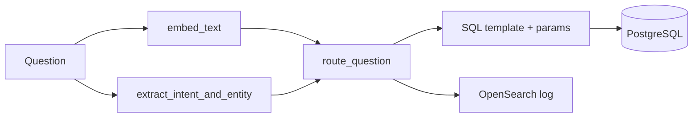

# Architecture

Plujka answers Polish election (PKW-style) questions by mapping natural language to **fixed SQL templates** and executing them against **PostgreSQL**. Optional **OpenAI** improves intent extraction and embeddings; without it, the stack uses deterministic fallbacks.

## Request path (`POST /ask`)

1. **Embedding** — `embed_text(question)` for semantic fallback routing (and OpenSearch logging).
2. **LLM** — `extract_intent_and_entity(question)` proposes an intent and entity when OpenAI is configured; unknown intents fall back to semantic matching against predefined intent phrases.
3. **Router** — `route_question` in `api/services/router.py` resolves year(s), location hints (districts, gminy, etc.), picks `SQL_TEMPLATES[intent]`, binds parameters, runs `db.run_sql`.
4. **Persistence** — Results come from PostgreSQL only; OpenSearch stores question metadata and embeddings for audit/search (`api/services/opensearch_store.py`).

## Startup and seeding

On API startup (`api/main.py`):

1. `db.init_database()` — schema / migrations as implemented in `api/services/db.py`.
2. `opensearch_store.ensure_index()` — creates the `question_logs` index if missing.
3. A **daemon thread** runs `seed.seed_if_empty()` — loads CSV data (path from `SEED_SAMPLE_CSV`, default under `data/sample/`) until the DB is populated.

`GET /health` returns `data_ready: true` only after seeding completes (`seed.seed_complete`). The Streamlit app polls `/health` periodically so users see when queries are safe to run.

## Question hints (`POST /question-hints`)

The Streamlit app calls this while the user types (≥ 2 characters) and after an answer to show **related past questions**. Responses combine **full-text** `match` on `question` and **kNN** on `question_embedding` (same 128-dim vectors as `log_question`). Short prefixes skip semantic search until `QUESTION_HINTS_SEMANTIC_MIN_CHARS` to limit embedding latency and OpenAI usage.

## Feedback (`POST /feedback`)

The Streamlit UI sends thumbs-up/down after each answer. **Thumbs-down** requests append one JSON line per event to `FEEDBACK_JSONL_PATH` (default `data/feedback/feedback.jsonl`) via `api/services/feedback_store.py`, including `needs_fix: true` and the full **`ask_response`** payload (question routing snapshot: `result`, `intent`, `sql`, `params`, etc.) for offline review. Thumbs-up lines omit `ask_response` and set `needs_fix: false`. In Docker, `./data` is mounted into the API container so logs land on the host under `data/feedback/`.

## Configuration

Central defaults and env vars are in `api/services/config.py` (`DATABASE_URL`, `OPENSEARCH_URL`, OpenAI models, `EMBEDDING_DIM`, `SEED_SAMPLE_CSV`, `FEEDBACK_JSONL_PATH`). Docker Compose wires these for containers (see `docker-compose.yml`).

## Where to change behavior

| Concern              | Location                          |
| -------------------- | --------------------------------- |
| Intents / SQL shapes | `api/services/sql_templates.py`   |
| Routing rules        | `api/services/router.py`          |
| LLM prompts / parsing| `api/services/llm.py`             |
| Embeddings           | `api/services/embeddings.py`      |
| Ingest / seed logic  | `api/services/seed.py`            |
| UI                   | `streamlit_app/app.py`            |
| Feedback JSONL       | `api/services/feedback_store.py`  |
